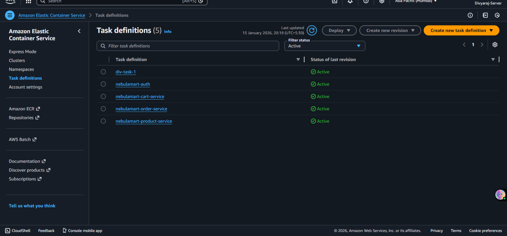
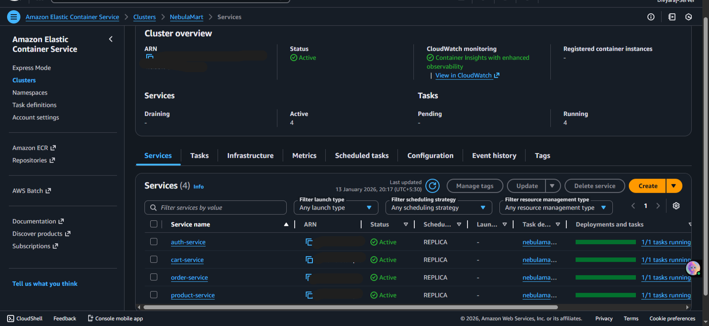
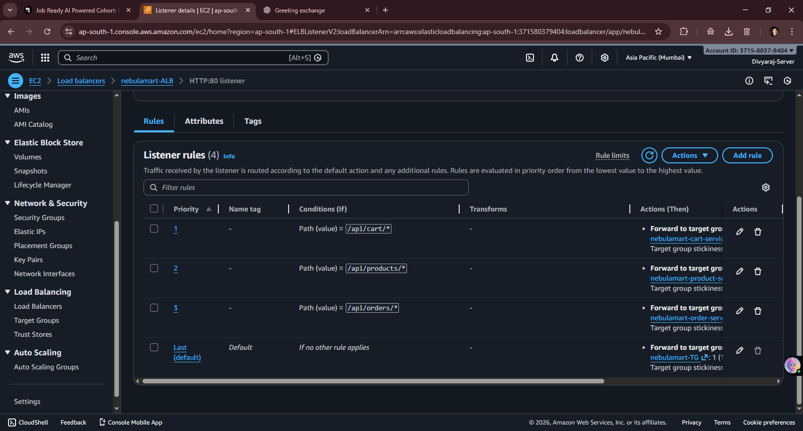
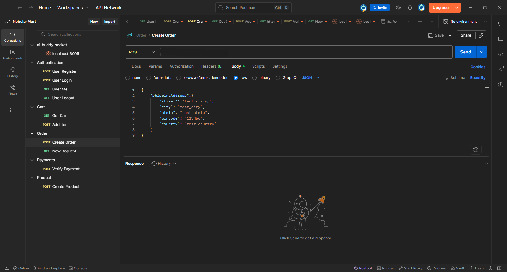
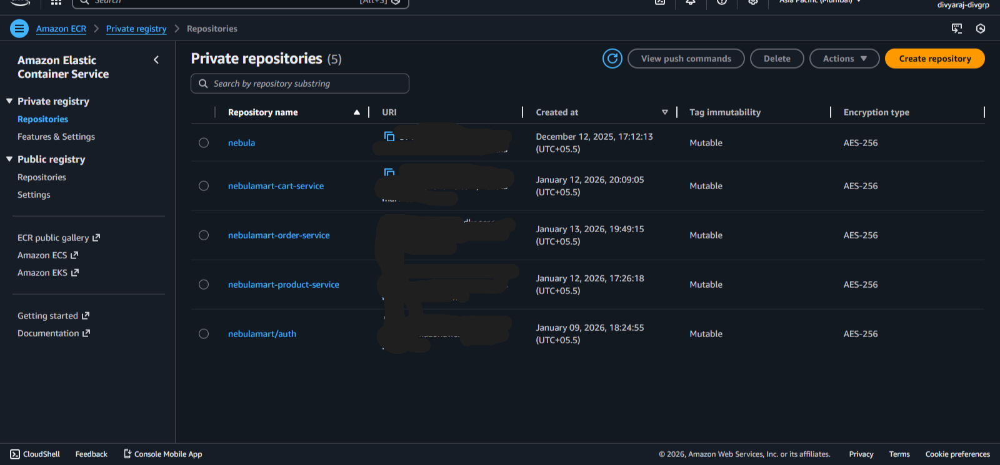
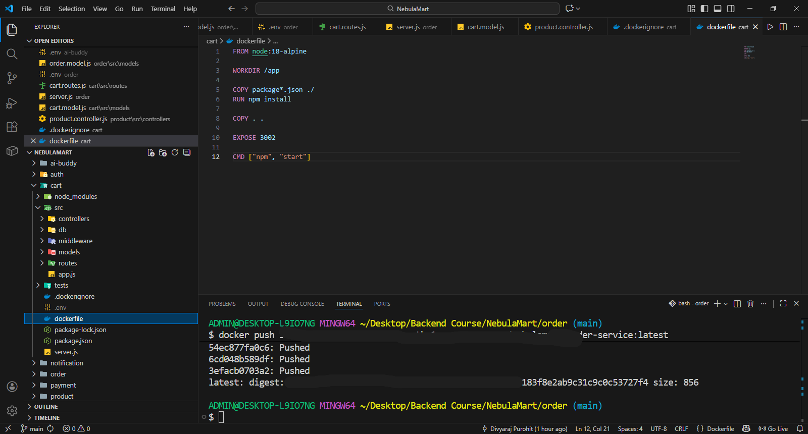
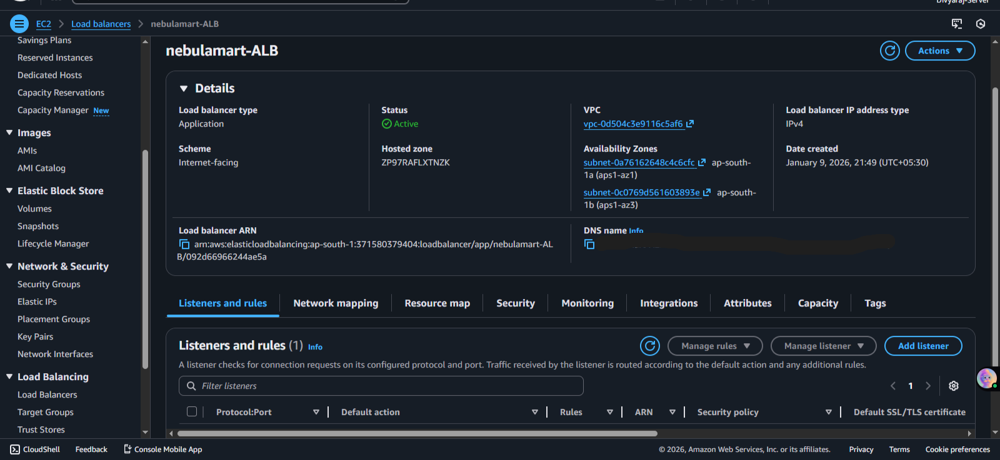
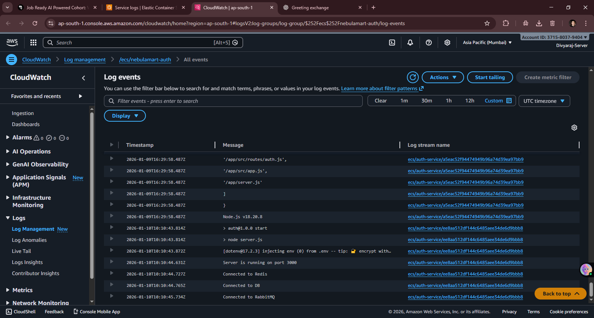

# NebulaMart 🛒
A microservices-based online marketplace built with real-world backend architecture.

## 🚀 Overview
NebulaMart is an e-commerce backend system designed using **microservices architecture**.
Each service runs independently, can be scaled separately, and communicates using both
synchronous and asynchronous methods.

The project is containerized using Docker and deployed on **AWS ECS (Fargate)**.

---

## 🧩 Services

- **Auth Service** – User registration, login & authorization
- **Product Service** – Product creation, listing & search
- **Cart Service** – Cart management
- **Order Service** – Order lifecycle & status
- **Payment Service** – Razorpay payment handling
- **Notification Service** – Email notifications
- **Seller Service** – Seller metrics & analytics
- **AI Buddy Service** – AI-powered shopping assistant

---

## 🔄 Service Communication

### Synchronous Communication
Used for critical flows via REST APIs (Axios).
Example: Order → Cart → Product

### Asynchronous Communication
Used for non-blocking tasks via **RabbitMQ**.
Example: User registration → Email notification

---

## 🧠 AI Buddy
The AI Buddy helps users:
- Discover products
- Compare items
- Get recommendations

Built using **LangGraph (StateGraph with nodes & edges)** to automate AI workflows.

---

## 🐳 Deployment & Infrastructure

- Docker (per-service Dockerfiles)
- AWS ECS (Fargate)
- Amazon ECR
- Application Load Balancer (ALB)
- RabbitMQ

---

## ⚙️ Environment Variables
Each service uses its own `.env` file.
Example configuration is provided in `.env.example`.

> Sensitive credentials are never committed.

---

## 🛠 Tech Stack

- Node.js
- Express.js
- MongoDB
- Docker
- AWS (ECS, ECR, ALB)
- RabbitMQ
- LangGraph
- Razorpay

---

These screenshots demonstrate the deployed microservices infrastructure and runtime behavior of the system.
## 📸 Deployment Screenshots

### ECS Services

### ECS Cluster Services

### ALb Listener

### Create Order Postman

### ECR Repository

### Docker Setup

### Load Balancer Configuration

### Logs & Monitoring

## 📌 Status
Project completed as part of an advanced backend development course.
Infrastructure cleaned after deployment to avoid unnecessary costs.

---

## 👤 Author
**Divyaraj Purohit**
